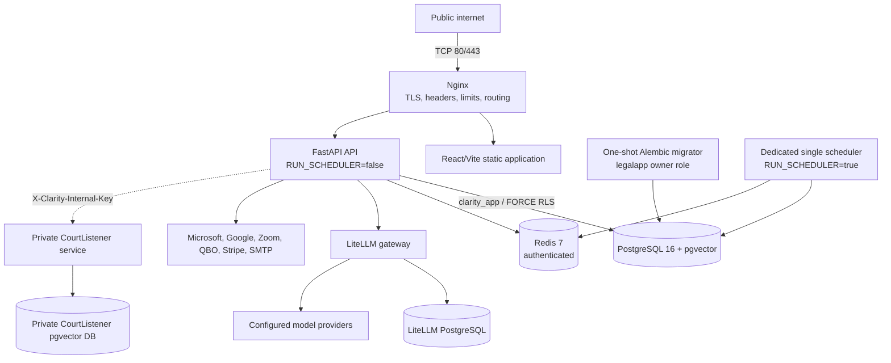

# Clarity Legal architecture and trust boundaries

This document describes the release architecture as implemented. It separates
customer-facing readiness from capabilities that exist in code but are still
release-gated.

## 1. Production topology

Clarity is a containerized single-host application for the first-customer
release.



The production Compose invariants are:

- Only nginx publishes host ports 80 and 443.
- PostgreSQL, Redis, backend, frontend, LiteLLM, scheduler, and optional
  CourtListener services have no public listener.
- `migrator` must finish successfully before API or scheduler startup.
- API processes set `RUN_SCHEDULER=false`; one scheduler process sets it to
  `true`. PostgreSQL advisory locks remain a duplicate-run backstop.
- Backend and scheduler use `APP_DATABASE_URL`, which must identify the
  `clarity_app` role. Alembic uses `MIGRATOR_DATABASE_URL`, which identifies the
  owner role.
- `/health/readiness` reports only component states for disk, database, Redis,
  scheduler heartbeat, and durable queue. It does not expose tenant IDs,
  credentials, queue payloads, or infrastructure addresses.

`docker-compose.hypervisor.yml` is the existing Skynet topology. A conventional
Linux VPS, including AWS Lightsail, uses `docker-compose.yml` plus
`docker-compose.prod.yml`. Both paths use digest-pinned foundational images and
the same nginx-only public boundary.

## 2. Persistence and failure domains

| Data | Persistence | Backup requirement |
|---|---|---|
| Application PostgreSQL | Named volume on the hypervisor; `/data/legalapp/postgres` bind mount in base+prod | Custom-format `pg_dump`, checksum, count manifest, encrypted off-host Restic snapshot, isolated restore proof |
| Uploaded and generated files | `./uploads` on the hypervisor; `/data/legalapp/uploads` in base+prod; mounted at `/app/uploads` in the container | Included in the off-host snapshot and compared during restore rehearsal |
| Redis | Persistent Compose volume with AOF enabled in production | Operational state only; PostgreSQL remains the durable business record |
| LiteLLM PostgreSQL | Dedicated volume/bind mount | Back up when gateway spend/config history is a recovery requirement |
| CourtListener corpus | Separate Compose volumes | Rebuildable corpus, but operational backup policy depends on ingest cost and local modifications |

This is not a highly available design. One host, one application database, one
Redis instance, and local file storage are single failure domains. The first
customer may run on this topology only with monitoring, encrypted off-host
backup, and a tested clean-host restore. Multi-host orchestration, database
failover, Redis failover, and point-in-time recovery are future scaling work.

## 3. Identity and authorization boundaries

### Application users

Email/password and Microsoft/Google sign-in issue a short-lived access token in
an HTTP-only cookie. Refresh tokens rotate and are tracked in Redis for replay
prevention and revocation. A signed plan claim drives navigation, while
`ModuleGuardMiddleware` independently blocks API prefixes outside the tenant's
licensed modules.

Tenant identity is never accepted from request JSON. Authenticated user and
tenant identity come from the verified session. Public provider callbacks and
webhooks use provider-bound state, tenant-specific URLs, signatures, or shared
secrets as appropriate.

### Platform operators

A raw platform bootstrap secret is accepted only at
`POST /api/platform/auth/token`. Production configuration stores its SHA-256
hash with a fixed operator identity, maximum scopes, and expiry. Exchange
returns a scoped bearer token with a default 15-minute lifetime. Platform
requests are rate limited and written to the operator audit log.

The legacy static `PLATFORM_SECRET_KEY` is a time-boxed migration bridge only.
New deployments leave `PLATFORM_LEGACY_BOOTSTRAP_ENABLED=false` and the legacy
secret unset.

### Stored provider credentials

OAuth tokens, tenant-owned OAuth app secrets, QBO tokens, tenant BYOK keys, and
platform model-provider keys are encrypted at the application layer. The
newest key in `TOKEN_ENCRYPTION_KEYS` encrypts writes; remaining keys decrypt
old ciphertext during a staged rotation. This keyring does not replace host or
volume encryption and is currently injected through the host's protected
`.env` file.

Tenant BYOK does not accept an arbitrary administrator-controlled base URL.
Provider selection and URL validation restrict outbound destinations so a
tenant configuration cannot turn the backend into an SSRF or prompt-exfiltration
proxy.

## 4. Tenant isolation

Tenant-scoped request handlers call `set_tenant_context()` before data access.
PostgreSQL tables use Row Level Security with `FORCE ROW LEVEL SECURITY`, and
the runtime role is `NOSUPERUSER NOBYPASSRLS`. Application predicates remain in
queries as defense in depth and to keep test intent visible.

Cross-tenant operations use narrow, explicit system paths. They must set a
transaction-local bypass only where a corresponding RLS bypass policy exists,
enumerate active tenants, and then restore tenant context. The dedicated
scheduler processes each active tenant separately. Scheduler logs are
tenant-scoped at migration `088`; legacy null-tenant rows are not returned by
tenant APIs.

## 5. First-customer workflow: Zoom call to assigned task

```mermaid
sequenceDiagram
    participant Z as Zoom Phone
    participant N as Nginx
    participant A as FastAPI
    participant D as PostgreSQL/RLS
    participant W as Durable Zoom worker
    participant U as Intake user
    participant T as Assignee

    Z->>N: signed event / tenant webhook URL
    N->>A: POST /api/integrations/zoom-phone/webhook/{tenant_id}
    A->>A: validate CRC or webhook signature + account mapping
    A->>D: commit one idempotent call job under tenant RLS
    A-->>Z: 2xx only after durable commit
    W->>D: claim tenant call job
    W->>Z: fetch authoritative call detail
    W->>D: atomic insert/update inbound communication record
    U->>A: review caller, contact/history matches, notes
    A->>D: create/update contact or lead and assignment task
    A-->>T: in-app task; optional configured notification
    T->>A: view, reassign, log customer contact, complete/close
    A->>D: task lifecycle + customer communication history
```

The tenant must own the Zoom account-level OAuth app configured through
Administration > Zoom; shared platform/S2S Phone credentials are not accepted.
The administrator records the firm's non-secret Zoom Account ID with the app.
If Zoom includes an account ID in the token response, OAuth rejects a mismatch,
but Zoom does not guarantee that field. Every new grant therefore remains in
`account_verification_required`: API probes and imports are blocked until a
correctly signed v3 call-element event supplies a matching `payload.account_id`
**and** the pending grant successfully fetches that event's exact call
history/detail from Zoom. The signed event proves the app account; the matching
provider fetch proves the grant can access that same account. Only then does one
transaction mark the grant healthy and import the call.
This explicit mapping avoids requesting a broader Zoom user-profile scope merely
to discover the account after authorization.
The shipped intake integration requests call-history/call-detail scopes; it
does not fetch Zoom recording or transcript content. A dedicated queue lane
retries transient failures and hourly reconciliation covers missed delivery.
Production acceptance requires all of the following through the real public
hostname:

1. OAuth connect/reconnect saves a grant pending provider account proof.
2. Zoom URL-validation CRC response succeeds through nginx/TLS.
3. A correctly signed v3 event for a real inbound call proves the app account.
4. The pending grant fetches that exact call, becomes healthy atomically with
   import, and the call appears once in Call Intake.
5. The API connection test passes.
6. Intake creates a specifically assigned task.
7. The assignee can view and update that task without cross-tenant leakage.

Unit and E2E tests support this evidence but do not replace the live provider
proof.

## 6. PDF template data flow

```mermaid
flowchart LR
    upload["Admin uploads PDF"] --> inspect["Validate PDF\nreject password, active content, XFA"]
    inspect --> fields["Discover AcroForm widgets\nmax 250 pages / 200 fields"]
    fields --> retain["Retain immutable source\npath + SHA-256 metadata"]
    retain --> review["Review field mapping and preview"]
    review --> activate["Admin activates template"]
    activate --> fill["Matter/user values + reviewed edits"]
    fill --> render["Fill and flatten by default"]
    render --> store["Matter document + timeline provenance"]
```



PDF layout is preserved because the renderer fills actual AcroForm widget
positions in the retained source. Static or scanned PDFs without AcroForm
fields can be analyzed but cannot become generation templates. Password
protection, JavaScript/actions, embedded files, XFA, unsupported widget
appearances, unsafe scripts/glyphs, and values that cannot fit safely fail with
an actionable error instead of emitting a silently corrupted document.

Preview does not store a matter document and does not enforce required fields.
Saving an active template to a matter enforces required fields, creates a
unique output name, stores the binary through the matter-file store, and adds a
matter event with source/output hashes and renderer metadata. Signature fields
remain blank for a later signing workflow.

See [PDF template operations](PDF_TEMPLATE_OPERATIONS.md).

## 7. Retrieval and cloud data

Clarity has three distinct context paths:

1. **Session attachments:** stored for download, extracted on demand, and
   bounded before prompt injection. They are not automatically embedded.
2. **Indexed documents:** text is chunked, embedded, and stored in pgvector for
   tenant RAG. Public CourtListener chunks use a separate public corpus path.
3. **Live cloud search:** Microsoft/Google provider search returns candidates;
   bounded content from selected hits is used for the request. The local cloud
   metadata index stores routing metadata rather than mirroring an entire drive
   or mailbox.

Matter-file output chooses the configured cloud provider when available and can
fall back to local storage. A fallback is reported to the caller; operators
must monitor storage errors rather than assume every generated file reached a
cloud provider.

AI/provider logging and retention depend on the configured gateway and model
provider. LiteLLM raw message logging is disabled by default, but infrastructure
configuration and vendor contracts still determine the full data-handling
posture.

## 8. MCP boundary and release gate

Public MCP is not part of the first-customer product.

- `MCP_PRODUCT_ENABLED=false` makes the public manifest and transport
  unavailable.
- Legacy unscoped `X-API-Key` issuance is retired and migration `087`
  invalidates existing legacy tenant API keys.
- The implemented `/api/mcp` endpoint uses the official Python SDK Streamable
  HTTP lifecycle and protocol negotiation.
- A product key is accepted only for an active tenant with explicit MCP
  entitlement, active billing, Stripe customer/meter configuration, tool scope,
  remaining monthly quota, and an available Redis burst limiter.
- A successful product call writes its usage event and durable Stripe meter job
  in one database transaction. Delivery retries use a stable identifier.
- Backend-to-sidecar traffic uses a dedicated `MCP_UPSTREAM_API_KEY`; application
  JWTs and customer keys are never forwarded.

These controls make the implementation fail closed; they do not constitute
commercial approval. Do not enable or promote MCP until the product-specific
deployment, billing reconciliation, monitoring, restore, and support gates in
[MCP product gateway](mcp_product_gateway.md) pass.

## 9. Marketing and SEO boundary

The public SPA emits absolute canonical/Open Graph/Twitter metadata, JSON-LD,
`robots.txt`, and a sitemap when built with `VITE_PUBLIC_SITE_URL`. Only `/`,
`/privacy`, and `/terms` are indexable. Private routes are runtime-labeled
`noindex, nofollow` and omitted from the sitemap.

This is still a client-rendered SPA, not SSR. Static metadata and a noscript
summary improve discovery, but crawl rendering and Core Web Vitals must be
measured after deployment. Public claims must stay within implemented and
operationally verified behavior; certification, uptime, trial, price, customer,
or provider claims require separate evidence and owner approval.

## 10. Deployment and rollback boundary

`scripts/deploy_prod.sh` is the on-host deployment gate. It performs preflight,
captures a pre-deploy dump/count manifest, starts PostgreSQL, builds the selected
topology, gates startup on migrations, waits for API/scheduler/nginx, validates
nginx and frontend image contents, refuses a post-deploy count decrease before
external provider checks, and then runs strict production checks. A fresh empty
host may use `BOOTSTRAP_MODE=true` once so an administrator can reach the UI and
configure its tenant-owned Zoom app; that mode is explicitly **NOT GO-LIVE** and
must be followed by the default strict production check.

Deployment is not the backup strategy. Before changing production, create and
copy an encrypted backup off-host. A rollback decision must preserve the new
database state: do not downgrade migrations or restore an old dump merely to
roll back containers without first assessing writes made after deployment.
Prefer rolling application code forward. If rollback is required, record the
deployed commit, failed gate, data-change window, selected image/commit, and
post-rollback production check.

The complete executable procedure and go/no-go checklist are in
[FIRST_CUSTOMER_PRODUCTION_RUNBOOK.md](FIRST_CUSTOMER_PRODUCTION_RUNBOOK.md).
