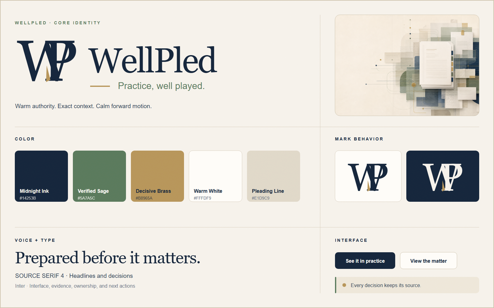

# WellPled brand guide

Status: production-ready identity direction and asset kit  
Date: July 31, 2026

## The idea

**WellPled** is the double promise that the work is well pleaded and the practice is well played.

It should feel like excellent counsel feels: prepared, exact, calm under pressure, and already holding the context everyone else is trying to reconstruct.

- **Position:** The operating context for excellent legal work.
- **Core promise:** Be prepared before the moment matters.
- **Primary tagline:** Practice, well played.
- **Product line:** The whole matter. The next move.
- **Proof line:** Every decision keeps its source.
- **Personality:** Articulate, composed, exact, quietly clever, warm.

## Continuity from Clarity

This identity is an evolution of the product's current design system, not a visual reset.

What remains:

- warm parchment and midnight navy as the dominant brand pair;
- Source Serif 4 for editorial authority and Inter for product clarity;
- muted sage for healthy, verified, and moving work;
- aged brass for selective emphasis;
- fine technical rules, structured grids, generous whitespace, and tactile paper imagery;
- the existing tone: warm, exact, secure, and source-aware.

What changes:

- the temporary CL badge becomes the folded WP mark;
- WellPled becomes the memorable, protectable name at the center of the system;
- “Practice, well played.” becomes the top-level brand expression;
- brass identifies a decisive fact or transition instead of acting as generic decoration;
- the visual metaphor shifts from generic clarity to complex work brought into order.

## Logo system

The mark is a custom **WP pleat**. A high-contrast W and P overlap like folded pages. The small brass wedge is the decisive point: the fact, decision, or assignment that changes what happens next.

Use the horizontal lockup in navigation, proposals, and normal brand signatures. Use the mark alone for favicons, app tiles, avatars, and compact sidebars. Use the stacked lockup only when the format is square or ceremonial.

### Clear space and minimum size

- Keep clear space around the mark equal to at least the width of the P stem.
- Keep clear space around a lockup equal to the cap height of the wordmark's lowercase letters.
- Digital minimum: 24 px high for the mark, 120 px wide for the horizontal lockup.
- Print minimum: 9 mm high for the mark, 32 mm wide for the horizontal lockup.
- Below 32 px, the brass fold may disappear; the navy/parchment silhouette must carry the identity by itself.

### Do not

- append a checkmark, gavel, scale, column, shield, or quill;
- recolor the mark with gradients or metallic effects;
- use the brass wedge as a freestanding icon;
- place the primary navy mark on dark or visually busy photography;
- stretch, outline, shadow, bevel, or rearrange the monogram;
- convert the brand into burgundy-dominant “traditional law firm” styling.

## Color system

| Role | Name | Value | Usage |
|---|---|---|---|
| Foundation | Midnight Ink | `#14253B` | Navigation, primary buttons, wordmark, long-form type |
| Canvas | Parchment | `#F7F3EC` | Page backgrounds and large quiet fields |
| Surface | Warm White | `#FFFDF9` | Cards, documents, exports, high-focus areas |
| Verified | Verified Sage | `#5A7A5C` | Healthy states, active context, verified sources |
| Decision | Decisive Brass | `#B8965A` | One consequential point, rule, node, or transition |
| Structure | Pleading Line | `#E1D9C9` | Borders, grids, dividers, inactive structure |
| Secondary text | Soft Ink | `#2D3F55` | Supporting copy and dense interface text |
| Muted text | Muted Slate | `#6A7587` | Metadata and lower-emphasis labels |
| Critical | Brief Rose | `#B5604E` | Errors and risk only; never a brand field |

Recommended visual proportion: roughly 55% parchment/warm white, 30% midnight, 10% sage, 4% line colors, and 1% brass.

## Typography

- **Display:** Source Serif 4, optical sizing enabled, weights 400–600.
- **Interface:** Inter, weights 400–700.
- **Fallback serif:** Georgia.
- **Fallback sans:** Arial.

Headlines should be editorial, short, and sentence case. Interface labels remain plain and operational. Avoid all-caps serif headlines; reserve spaced uppercase Inter for eyebrows, provenance, and small navigation labels.

## Voice

WellPled writes like a strong attorney explains a matter to a trusted colleague: precise, direct, and fully aware of why a detail matters.

### Principles

1. **Say what is known.** Prefer specific facts, owners, dates, and sources.
2. **Connect fact to consequence.** Explain what changed and what it changes.
3. **Make the next move visible.** Do not stop at reporting status.
4. **Use the wit once.** “Well played” is a reward, not a gimmick repeated in every sentence.
5. **Stay human.** Avoid AI superlatives, legal theater, and transformation clichés.

### Core copy

- **Homepage hero:** Practice, well played.
- **Homepage support:** Every fact, document, deadline, decision, and next action held in context—so excellent legal work does not depend on reconstructing the story.
- **Primary CTA:** See it in practice
- **Secondary CTA:** View the matter
- **Product promise:** The whole matter. The next move.
- **Trust proof:** Every decision keeps its source.
- **Operational proof:** Know what changed—and what it changes.
- **Preparation line:** Prepared before it matters.

## Imagery

Use tactile editorial collages of briefs, source cards, aligned records, fine connective rules, and restrained nodes. Images should show complexity resolving into an organized legal record. Preserve a calm negative-space field for real HTML copy.

Avoid generic courthouse photography, dramatic trial scenes, fake handwritten text, AI particles, glowing networks, gavels, scales, and decorative law books.

## Header system

| Asset | Size | Purpose |
|---|---:|---|
| Social/Open Graph card | 1200 × 630 | Website sharing, social previews, presentation cover |
| LinkedIn cover | 1584 × 396 | Company or founder profile header |
| Email header | 1200 × 280 | Announcements, onboarding, product updates |
| Document header | 1200 × 200 | Reports, exports, proposals, PDFs |

Headers may use the editorial artwork, but the actual logo and copy remain deterministic vector elements. This keeps type sharp and prevents generative text errors.

## Asset inventory

The working kit lives in [`frontend/public/brand/wellpled`](../../../frontend/public/brand/wellpled/).

- `wellpled-mark.svg` / `wellpled-mark-reversed.svg`
- `wellpled-logo-horizontal.svg` / reversed version
- `wellpled-logo-stacked.svg`
- `favicon.svg`, 16 px, 32 px, 180 px, 192 px, and 512 px PNGs
- `wellpled-social-card.svg` and `.png`
- `wellpled-linkedin-cover.svg` and `.png`
- `wellpled-email-header.svg` and `.png`
- `wellpled-document-header.svg` and `.png`
- `wellpled-brand-sheet.svg` and `.png`
- `wellpled-hero-editorial.png`
- `wellpled-brand-board-v2.png`
- `wellpled-tokens.css`
- `index.html`, a browsable brand preview

The reusable React lockup is [`WellPledLogo.jsx`](../../../frontend/src/components/WellPledLogo.jsx).

## Adoption note

This kit is intentionally staged beside the existing Clarity assets. It does **not** rename the running application, alter legal notices, replace production favicons, or change SEO metadata. Those changes should happen together after naming and trademark clearance, so customers do not encounter a partial rebrand.
