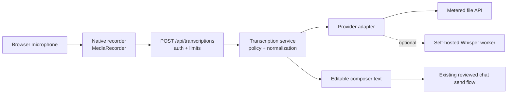

# Chat Dictation and Transcription Feature Plan

**Date:** 2026-08-02

**Status:** Proposed and intentionally deferred

**Decision:** Preserve a provider-neutral design, but do not implement transcription until customer demand justifies the product and maintenance work. If activated, begin with short, completed recordings that become editable chat drafts. Do not begin with realtime voice chat.

## Outcome

LawHand users should eventually be able to dictate a prompt into the existing chat composer, review and edit the generated text, and send it through the existing chat flow. The feature must not automatically send model-generated transcription, retain raw audio by default, or couple the chat-completion model to a speech provider.

The intended interaction is:

1. The user selects the microphone control in the chat composer.
2. The browser requests microphone permission and displays an unmistakable recording state and timer.
3. The user stops or cancels the recording.
4. LawHand transcribes the completed, bounded recording.
5. The transcript is inserted at the user's cursor as editable draft text.
6. The user reviews names, dates, numbers, citations, and legal terminology before sending.

This is dictation into chat, not a speech-to-speech assistant and not unattended legal automation.

## Cost-First Recommendation

At the current customer volume, a metered file-transcription API is likely cheaper than operating a dedicated inference service. The design should nevertheless keep a self-hosted option available so pricing, privacy requirements, or scale can change without rebuilding the composer.

Pricing below is a planning snapshot from 2026-08-02 and must be rechecked before implementation. OpenAI currently lists the following estimated transcription rates:

| Path | Current estimated rate | 100 minutes | 1,000 minutes | Planning position |
|---|---:|---:|---:|---|
| `gpt-transcribe` file transcription | $0.0045/minute | $0.45 | $4.50 | Recommended managed baseline if its legal-vocabulary evaluation passes |
| `gpt-4o-mini-transcribe` file transcription | $0.003/minute | $0.30 | $3.00 | Cost comparison candidate; use only if its measured critical-entity accuracy is acceptable |
| `gpt-live-transcribe` realtime transcription | $0.017/minute | $1.70 | $17.00 | Later enhancement only; added cost and connection complexity are not justified for initial dictation |
| Self-hosted Whisper-family inference | No per-minute API bill | Infrastructure-dependent | Infrastructure-dependent | Privacy or scale option, not the default cost-saving assumption at low volume |

Official pricing reference: [OpenAI API pricing](https://developers.openai.com/api/docs/pricing#transcription-models).

The small difference between the two managed file models is only $1.50 per 1,000 minutes at the current rates. Accuracy on legal names, dates, amounts, negation, and citations is therefore more important than selecting the lowest nominal per-minute price.

### Monthly cost controls

If the feature is activated, enforce all of the following from its first release:

- A platform-wide monthly transcription-minute budget with an operator-visible warning threshold and hard stop.
- A per-tenant monthly minute allowance, configurable without a deploy.
- A maximum recording length of 120 seconds for initial chat dictation.
- A separate concurrency limit so transcription cannot exhaust the web/API worker pool.
- Metadata-only usage records containing duration, model, outcome, and latency, but no audio or transcript text.
- An admin kill switch and a tenant feature flag.
- No realtime session while completed-recording transcription meets the product need.

Do not rely on a vendor's promotional free tier. Free-tier availability can change, and a legal product needs a stable privacy, retention, and support boundary.

## Provider Strategy

### Managed first, if implemented at low volume

OpenAI currently recommends `gpt-transcribe` for bounded recordings. It supports contextual prompts, keyword hints, language hints, common browser audio formats, and files up to 25 MB. The initial LawHand limit should be much lower than 25 MB because this feature is short-form dictation, not meeting transcription.

References:

- [OpenAI speech-to-text guide](https://developers.openai.com/api/docs/guides/speech-to-text)
- [OpenAI transcription overview](https://developers.openai.com/api/docs/guides/transcription)
- [OpenAI realtime transcription guide](https://developers.openai.com/api/docs/guides/realtime-transcription)

The existing `openai==1.58.1` backend dependency must be tested against the current Audio API before implementation. Upgrade it only as a scoped compatibility change with regression tests; do not tie a transcription spike to an unrelated LLM migration.

### Self-hosted fallback

If external processing is unacceptable or paid usage becomes material, evaluate `faster-whisper` behind the same backend contract. It supports CPU/GPU inference and integer quantization, but its zero API price does not mean zero cost: model memory, cold starts, latency, deployment, capacity, monitoring, and upgrades all become LawHand responsibilities.

Candidate references:

- [OpenAI Whisper repository and model sizes](https://github.com/openai/whisper)
- [`faster-whisper` repository, requirements, and benchmarks](https://github.com/SYSTRAN/faster-whisper)
- [`whisper.cpp` repository](https://github.com/ggml-org/whisper.cpp)

Do not ship self-hosted inference until it passes the same legal-dictation corpus as the managed candidate on production-like hardware. A small CPU model may be inexpensive but still be the wrong product if it repeatedly corrupts names, amounts, deadlines, or negation.

### Paths rejected for the initial release

- Browser Speech Recognition/Web Speech API as the primary engine: apparent zero cost, but insufficient control over browser support, provider behavior, retention, and reproducibility.
- A large frontend transcription SDK: native `getUserMedia` and `MediaRecorder` are adequate for bounded recording.
- Realtime transcription: more expensive and operationally more complex, with partial-text reconciliation and connection recovery that completed-recording dictation does not require.
- Audio sent through the existing chat model alias: speech recognition is a separate workload with a separate provider, model, budget, and failure boundary.
- Persistent audio attachments: dictation audio is transient input and must not inherit the existing chat-attachment retention behavior.

## Activation Gates

The feature should remain documentation-only until all of these gates are met:

1. At least one real customer or design partner confirms that chat dictation solves a recurring workflow problem.
2. Product scope remains bounded to editable dictation rather than calls, meetings, diarization, or voice-agent responses.
3. A provider and data-processing path are accepted for attorney-client and tenant-confidential content.
4. A representative private evaluation corpus exists and has measurable release thresholds.
5. The monthly spend cap and tenant allowance are selected.
6. Supported browsers and embedded surfaces are chosen, including whether Teams and mobile web are in the first support matrix.

## Target Architecture



The browser owns microphone capture and user-visible recording state. The backend owns authentication, tenant policy, budget enforcement, provider credentials, request normalization, timeouts, usage records, and data minimization. The transcription result returns to the composer and is not persisted until the user sends the resulting chat message.

## Client Design

Add the microphone control to `frontend/src/components/ChatInput.jsx` beside the existing attachment control. Keep recording logic in a focused hook or controller instead of adding more asynchronous state directly to the visual component.

Suggested files:

```text
frontend/src/components/ChatInput.jsx
frontend/src/hooks/useChatDictation.js
frontend/src/api.js
```

### Explicit client states

```text
idle
requesting_permission
recording
stopping
uploading
transcribing
ready
failed
cancelled
```

Every state transition must have a user-visible result. The client must never appear idle while microphone capture is active.

### Recording behavior

- Use `navigator.mediaDevices.getUserMedia({ audio: true })` in a secure context.
- Use `MediaRecorder.isTypeSupported` to negotiate a browser-supported MIME type rather than assuming WebM everywhere.
- Preserve existing typed text and the textarea selection before recording.
- Insert the final transcript at the saved cursor, adding sensible whitespace without replacing the user's draft.
- Provide distinct Stop and Cancel controls.
- Stop every `MediaStreamTrack` after stop, cancel, navigation, device loss, or component unmount.
- Abort an in-flight upload when the user cancels or leaves chat.
- Retain the audio blob only long enough to offer one explicit retry after a transient failure, then release it.
- Disable recording while the assistant is responding only if the composer itself remains disabled; do not create a conflicting send state.
- Never auto-send a transcript.

### Accessibility and degraded behavior

- Give the microphone, stop, cancel, and retry controls explicit accessible names.
- Announce permission, recording, processing, completion, and failure through an ARIA live region.
- Do not use color alone for the recording indicator.
- Provide actionable permission-denied guidance.
- Leave typing and attachments fully usable when microphone APIs are unavailable.
- Show a short review reminder for names, dates, amounts, and citations after transcription.

## Backend Contract

Add a dedicated router rather than extending the persistent attachment endpoint:

```http
POST /api/transcriptions
Content-Type: multipart/form-data

file=<audio>
conversation_id=<optional UUID>
matter_id=<optional UUID>
language=<optional language hint>
request_id=<client-generated idempotency key>
```

Example normalized response:

```json
{
  "text": "Please summarize the February 12 deposition and identify open discovery issues.",
  "language": "en",
  "duration_ms": 18400,
  "request_id": "8d06b834-1a58-4bca-8c9f-77e602a067d9"
}
```

Suggested files:

```text
backend/app/routers/transcriptions.py
backend/app/services/transcription.py
backend/app/services/transcription_providers/base.py
backend/app/services/transcription_providers/openai_provider.py
backend/app/schemas/transcription.py
backend/app/config.py
backend/tests/test_transcriptions.py
```

### Provider interface

```python
class TranscriptionProvider(Protocol):
    async def transcribe(
        self,
        *,
        audio: BinaryIO,
        content_type: str,
        context: TranscriptionContext,
    ) -> TranscriptionResult: ...
```

`TranscriptionResult` should normalize text, detected language when available, audio duration, provider request ID, provider/model metadata for internal usage records, and a stable error category. Provider-specific event shapes must not reach React components.

### Configuration

```env
TRANSCRIPTION_ENABLED=false
TRANSCRIPTION_PROVIDER=openai
TRANSCRIPTION_MODEL=gpt-transcribe
TRANSCRIPTION_MAX_SECONDS=120
TRANSCRIPTION_MAX_BYTES=10000000
TRANSCRIPTION_TIMEOUT_SECONDS=30
TRANSCRIPTION_MONTHLY_MINUTES=0
TRANSCRIPTION_DEFAULT_TENANT_MINUTES=0
```

Zero allowances keep the deferred feature fail-closed even if code is deployed before commercial activation.

## Legal Vocabulary Context

When a conversation is explicitly linked to a matter and the selected provider is authorized to process matter data, the backend may create a short transcription glossary containing only relevant literal terms:

- Party and attorney names.
- Court and jurisdiction names.
- Case number.
- Agencies, statutes, products, or uncommon acronyms likely to be dictated.

Do not send the full matter, document text, conversation history, or retrieved legal sources to the transcription provider. Keywords are hints and can bias output, so the glossary must be short, sanitized, and evaluated for insertion of terms that were never spoken.

Privacy mode must not silently route confidential audio to an external service. It must either select a tenant-approved private provider or leave dictation unavailable with a clear explanation.

## Security, Privacy, and Retention

- Apply existing authenticated-user and tenant boundaries to every request.
- Validate the declared MIME type and inspect the actual file signature before provider use.
- Reject unsupported formats, empty files, excessive bytes, excessive duration, and decompression/resource abuse.
- Use a bounded spooled temporary file or equivalent request-scoped storage; delete it in a `finally` path.
- Never write dictation audio to chat attachment or matter-document storage by default.
- Never log audio, transcript text, matter glossary content, provider payloads, or response bodies.
- Store only tenant/user IDs, request ID, duration, byte count, provider/model, latency, status, sanitized error code, and cost estimate in usage telemetry.
- Rate-limit by user and tenant, limit concurrent jobs, and make retries idempotent.
- Treat transcript text as untrusted user input when it later enters the existing chat pipeline.
- Confirm the provider contract, data-processing terms, region, retention controls, and incident path before customer use.

OpenAI's current data-control table says `/v1/audio/transcriptions` is not used for training and has no abuse-monitoring or application-state retention, while remaining eligible for Zero Data Retention. This is useful provider evidence but does not replace LawHand's own legal, contractual, and deployment review: [OpenAI data controls](https://developers.openai.com/api/docs/guides/your-data#storage-requirements-and-retention-controls-per-endpoint).

## Reliability and Error Contract

Normalize provider and network failures into stable client categories:

| Error | Client behavior |
|---|---|
| `microphone_unavailable` | Keep typing available and explain device/browser support |
| `permission_denied` | Show browser-specific permission recovery guidance |
| `recording_too_long` | Stop at the limit and allow the bounded recording to be transcribed |
| `unsupported_audio` | Explain the unsupported browser/container combination; do not retry automatically |
| `budget_exhausted` | Disable dictation for the applicable tenant/month without affecting chat |
| `provider_timeout` | Offer one explicit retry while the local blob remains available |
| `provider_unavailable` | Preserve the user's typed draft and offer retry later |
| `empty_transcript` | Return to the composer without inserting placeholder text |
| `cancelled` | Discard audio and restore the prior draft/selection |

Automatic provider retries must be bounded and use the same request ID. They must never create duplicate usage or billing records.

## Evaluation and Release Gates

Create a private, consented evaluation set representing actual LawHand use rather than clean synthetic speech. Include:

- Party, attorney, judge, court, county, and agency names.
- Case numbers, statute sections, citations, email addresses, and file numbers.
- Dates, times, currency, percentages, phone numbers, and street addresses.
- Negation and legally material qualifiers.
- Mobile, laptop, headset, and embedded-webview microphones.
- Accents, code-switching, background office noise, pauses, corrections, and false starts.
- Silence, clipped audio, device disconnects, and maximum-duration recordings.

Track:

- Overall word error rate.
- Exact-match accuracy for names, dates, amounts, case numbers, and negation.
- Empty, truncated, duplicated, and unsupported-audio rates.
- Hallucinated speech during silence/noise.
- Time to recording indication, upload time, transcription latency, and end-to-end time.
- Retry, cancellation, and permission-denial outcomes.
- Estimated and actual cost per accepted transcript minute.

Do not set numerical release thresholds until the representative corpus establishes a realistic baseline. Once selected, thresholds must be checked into the implementation PR and applied equally to managed and self-hosted candidates.

## Test Strategy

### Frontend

- State-machine transition tests for success, stop, cancel, timeout, retry, unmount, and device loss.
- Cursor-preserving insertion into empty, partially typed, and selected composer text.
- Existing text and attachments survive every failure path.
- Media stream tracks are stopped on all terminal paths.
- Accessibility tests for control names, keyboard use, focus, live announcements, and non-color recording indication.
- Mocked `MediaRecorder`, media permissions, MIME support, and `AbortController` behavior.

### Backend

- Authentication, tenant isolation, module availability, and disabled-feature behavior.
- Byte, duration, MIME, signature, timeout, concurrency, and monthly-budget enforcement.
- Provider adapter contract tests and sanitized error mapping.
- Idempotent retries and exactly-once usage accounting.
- Temp-file cleanup on success, provider error, client disconnect, timeout, and cancellation.
- Assertions that audio, transcript, and glossary content never enter logs or usage records.

### Browser and surface matrix

Before declaring support, exercise current Chrome, Edge, Firefox, Safari, iOS Safari, Android Chrome, and the Teams embedded surface. An unsupported surface must retain a fully functional text composer and simply omit or disable dictation with a reason.

## Delivery Slices

### Slice 0 — Demand and evaluation only

- Keep the production feature disabled and make no code changes.
- Confirm customer demand and initial supported surfaces.
- Build the consented legal-dictation evaluation set.
- Recheck pricing, provider retention terms, SDK compatibility, and available hardware.
- Benchmark at least one managed candidate and, only if justified, one self-hosted candidate.

**Exit gate:** a written go/no-go decision identifies provider, target quality, supported surfaces, budget, and data-processing approval.

### Slice 1 — Completed-recording dictation

- Implement the native recorder, explicit client state machine, dedicated authenticated endpoint, provider adapter, cost limits, metadata-only usage, and editable transcript insertion.
- Limit recordings to 120 seconds.
- Keep audio transient and never auto-send.
- Ship behind platform and tenant flags with zero allowances by default.

**Exit gate:** quality thresholds, privacy tests, browser matrix, cost enforcement, failure recovery, and kill switch all pass.

### Slice 2 — Self-hosted provider, only if justified

- Add a worker-backed `faster-whisper` adapter without changing the browser or API contract.
- Add health/capacity checks, model warmup, queue limits, and deployment documentation.
- Compare cost, latency, and critical-entity accuracy against the managed baseline.

**Exit gate:** self-hosting is measurably preferable on total cost or required for privacy, not merely free of per-minute API charges.

### Slice 3 — Realtime transcription, only after usage evidence

- Add realtime partial-text transport and reconciliation.
- Treat final completion events as canonical.
- Add connection recovery, ordering, partial-revision UI, and realtime-specific quotas.

**Exit gate:** customer research shows that post-stop transcription is materially insufficient and the added cost and maintenance are accepted.

## Non-Goals

- Recording calls, meetings, clients, or other speakers.
- Speaker diarization or voice identification.
- Voice biometrics or retained speaker reference clips.
- Speech-to-speech assistant responses.
- Automatic chat submission, tool execution, matter writes, or deadline creation from speech.
- Long-form transcript storage, meeting summaries, subtitles, translation, or evidence-grade verbatim transcripts.
- Replacing professional court reporters, deposition services, or human review.

## Definition of Done for a Future First Release

- A supported user can record, stop, transcribe, edit, and deliberately send a short chat prompt.
- Typed text, attachments, focus, and cursor placement survive success and every failure path.
- Recording is always visible; cancellation and track cleanup are deterministic.
- No audio is persisted and no audio/transcript/glossary content appears in logs or usage telemetry.
- Provider/model choice is isolated behind a backend adapter and separate from the chat LLM router.
- Tenant and platform minute budgets fail closed without impairing ordinary text chat.
- Representative legal-dictation quality and browser/surface gates pass.
- Privacy, provider retention, operational monitoring, incident response, and kill-switch procedures are approved.
- The feature remains off for tenants with no explicit allowance.
