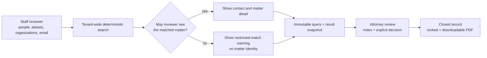
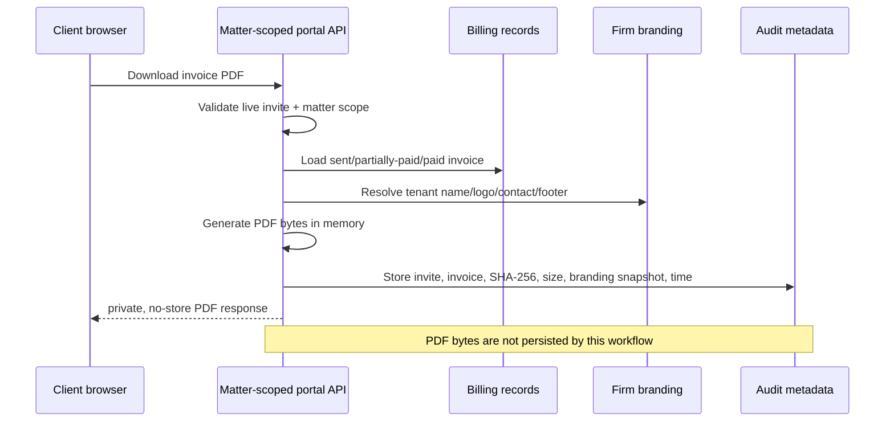

# Conflict search and portal invoice architecture

This document describes the two customer workflows added after the task and
correspondence discovery: saved conflict-review evidence and branded client
portal invoice downloads. It is the backend contract for authorization,
retention, and audit behavior.

## Why these behaviors are conventional

Official competitor documentation makes the customer expectation unusually
clear:

- [Clio conflict checks](https://help.clio.com/hc/en-us/articles/41182681954331-Conflict-Checks-in-Clio-Manage-and-Clio-Grow)
  preserve the searches, per-result review, notes, overall decision, timestamps,
  linked matters, closed report, and PDF output. Clio also separates report
  permissions and hides details a reviewer cannot access in its
  [role-permission model](https://help.clio.com/hc/en-us/articles/40062980685467-Overview-of-Custom-Role-Permissions).
- [Smokeball conflict checks](https://support.smokeball.com/hc/en-gb/articles/6112123480983-Conflict-Checks)
  search across contacts and documents, accept notes, and save a PDF snapshot to
  the matter.
- [Clio bill themes](https://help.clio.com/hc/en-us/articles/9285055886235-Bill-Themes-and-Customizations)
  include firm logo/contact/footer customization, and its
  [client portal](https://help.clio.com/hc/en-us/articles/9156800144283-Clio-for-Clients-Client-Actions)
  lets a client download a bill. Clio records download activity in the
  [bill timeline](https://help.clio.com/hc/en-us/articles/27926649697179-Bill-Timeline).
- [PracticePanther's portal](https://support.practicepanther.com/en/articles/479922-what-does-the-client-portal-look-like-to-my-clients)
  is white-labelled with firm identity, and its
  [invoice workflow](https://support.practicepanther.com/en/articles/2118416-viewing-your-invoices-in-the-client-portal)
  exposes a PDF download.

The LawHand implementation follows those workflow expectations without copying
competitor terminology or treating a search result as legal clearance.

## Conflict-review flow

### API and persistence

| Component | Contract |
| --- | --- |
| `POST /api/conflict-checks` | Normalizes and deduplicates bounded search terms, runs the existing tenant-wide contact/counterparty search, applies matter visibility, and persists the exact result shown. |
| `GET /api/conflict-checks` | Admins see tenant records. Other users see records they created or records linked to an assigned/owned matter. |
| `POST /api/conflict-checks/{id}/close` | Requires review notes and an explicit acknowledgement that the search is not automatic clearance. Closed records cannot be changed. |
| `GET /api/conflict-checks/{id}/report.pdf` | Generates a report from the saved snapshot, not a new live search. |
| `conflict_checks` | RLS-protected tenant row containing query JSON, result JSON, counts, decision, reviewer IDs, notes, and timestamps. |

Non-admin searches still run across the tenant so a hidden matter cannot become
a false negative. A counterparty-only hit on a matter the reviewer cannot see is
replaced with `Restricted potential match`; the matter ID, name, and
counterparty identity are omitted. The reviewer must escalate it to an
administrator or conflicts reviewer.

`needs_review` is the initial state even when `match_count` is zero. Supported
closed decisions are `no_conflict_found`, `conflict_found`, and
`cleared_with_conditions`. The application does not set matter or lead clearance
automatically.

## Client portal invoice flow

### Authorization and retention

- The invoice must belong to the portal token's tenant and matter.
- Draft and void invoices return `404`; the endpoint does not reveal whether a
  hidden invoice exists.
- The same tenant branding used by trust statements now controls invoice firm
  name, logo, address, phone, email, website, and optional PDF footer.
- The invoice PDF omits tenant IDs and internal matter IDs. It displays the
  matter name and current balance.
- `Cache-Control: private, no-store` prevents shared-cache retention.
- `portal_invoice_downloads` stores only identifiers, recipient email, download
  time, PDF SHA-256, byte length, and the branding values used. It has no PDF
  content column and is protected by tenant RLS.

The metadata audit proves which rendered version was returned without making
LawHand a second document repository. If durable invoice-version archives are
later required, they should be written to the tenant's selected customer cloud,
not added as an application blob column.

## Deliberately not decided here

This implementation does not settle the higher-liability or broader architecture
questions from the discovery:

- court-rules deadline calculation and version maintenance;
- Outlook/Google write-back and divergence ownership;
- versioned global intake and probate questionnaires;
- cross-entity Workspace MCP search; or
- migration of legacy locally stored customer document content.

Those remain in the evidence-backed backlog in
[task-correspondence-discovery-2026-08-26.md](task-correspondence-discovery-2026-08-26.md).
