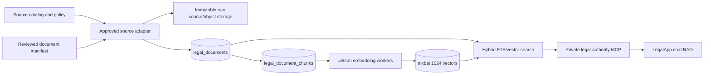

# Legal Authority Registry and Ingestion Architecture

## Purpose

This design extends the existing CourtListener public corpus into a policy-aware legal
authority service for statutes, regulations, rules, forms, manuals, and official
guidance. It is deliberately separate from tenant documents and from live restricted
records.

The current service remains named `courtlistener-mcp` for deployment compatibility. A
future low-risk rename can call it `legal-authority-mcp`; do not rename containers,
volumes, credentials, and monitoring during demo polish.

## Data flow



Raw object storage is the intended production path for XML/PDF/bulk packages. The first
HTML pilot stores normalized source text and a hash in PostgreSQL; `raw_storage_uri` is
reserved for the immutable source copy.

## Database mapping

### `legal_sources`

One row per source collection or tool. It owns:

- publisher, jurisdiction, authority tier, and official/aggregator status;
- ingestion mode, storage policy, access type, and license-review state;
- canonical/terms URLs, format, sync cadence, priority, and enabled state;
- coverage boundaries, sync timestamps, parser/embedding provenance, counts, and error;
- practice-area and implementation metadata from the source catalog.

Catalog seeding updates policy/configuration fields but deliberately preserves operational
counts, checkpoints, and timestamps.

### `source_sync_states`

One row per source partition. Partitions can be a CourtListener court, U.S. Code title,
CFR title, agency/contractor, tax year, local court, or manifest. It stores the cursor,
checkpoint, partial-run state, counts, and retry error.

### `opinions` / `opinion_chunks`

The existing optimized CourtListener model remains intact. This avoids a migration of the
large case-law corpus and preserves case/docket/citation relationships.

### `legal_documents`

Stable normalized source records for non-case material. Identity is
`(source_key, external_id)`. Important temporal fields are distinct:

- `publication_date` — when the publisher released it;
- `effective_date` — when the authority became operative;
- `termination_date` — repeal, expiration, or supersession boundary;
- `source_modified_at` — upstream last-modified metadata; and
- `retrieved_at` — when our copy was fetched.

`content_hash` controls idempotency. An unchanged retrieval updates freshness metadata
without invalidating embeddings. A changed normalized body replaces its chunks and queues
new embeddings.

### `legal_document_chunks`

Hybrid-search units with generated PostgreSQL FTS, a 1024-dimension mxbai vector,
per-chunk hashes, embedding provenance, and heading/metadata space. The embedding worker
prefixes each chunk with jurisdiction, authority tier, and document title:

```text
[US] [agency_guidance] Medicaid Estate Recovery
<chunk text>
```

This keeps different authority types separable in semantic retrieval. Reviewed authority
chunks drain before the much larger opinion embedding backlog.

## Source policy contract

The base catalog is `mcp-server/mcp_server/legal_sources.json`. Jurisdiction and
research-family additions live in `mcp-server/mcp_server/source_fragments/*.json` and
are merged automatically in lexical filename order. This keeps large research passes
reviewable without creating one conflict-heavy file; validation still treats the merged
result as a single catalog and rejects duplicate keys. Validation prevents:

- enabling a robots-blocked source;
- enabling a source whose terms are still under review or restricted;
- mirroring a query-time-only source;
- storing text without a corpus table; and
- treating open-source parsing software as a legal corpus.

The reviewed-document pilot is `mcp-server/mcp_server/authority_manifest.json`. It
supports bounded HTML and PDF extraction, but it is not a general crawler. A document
must be explicitly listed, remain under the per-artifact byte limit, and have a parent
source that permits local normalized storage.

## Commands

From `mcp-server/`:

```powershell
# Validate and summarize the source catalog.
python -m mcp_server.source_catalog

# List policy and implementation state for every source.
python -m mcp_server.source_catalog --list

# Validate the reviewed document manifest without network or database access.
python -m mcp_server.authority_ingest

# Fetch and parse the reviewed pilot without writing to PostgreSQL.
python -m mcp_server.authority_ingest --preview

# Initialize schema, seed the catalog, fetch, chunk, and store reviewed documents.
python -m mcp_server.authority_ingest --sync --db-url $env:VECTORDB_URL

# Limit an explicit production pilot to one source.
python -m mcp_server.authority_ingest --sync `
  --source-key cms:medicaid-estate-recovery `
  --db-url $env:VECTORDB_URL

# Production adapter previews never write to PostgreSQL.
python -m mcp_server.uscode_ingest --preview --title 26 --limit 10
python -m mcp_server.ecfr_ingest --preview --title 26 --limit 10
python -m mcp_server.cms_ingest --preview --coverage-entity ncd --limit 10
python -m mcp_server.cms_ingest --preview --discover manual --limit 10
python -m mcp_server.irs_ingest --preview --irb --forms --limit 10
python -m mcp_server.benefits_authority_ingest --preview `
  --source-key cms:medicaid-estate-recovery --limit 1
python -m mcp_server.ohio_authority_ingest --preview `
  --contact operations@example.com --limit 10 --delay 2
python -m mcp_server.nd_authority_ingest --preview `
  --contact operations@example.com --limit 10 --delay 2

# Run one overlap-protected production cycle. Adapter checkpoints live on the
# legal_authority_cache volume when this command runs through Compose.
python -m mcp_server.authority_scheduler --once --db-url $env:VECTORDB_URL
```

Set `LEGAL_SOURCE_USER_AGENT` to a descriptive product/contact value for production and
`LEGAL_SOURCE_REQUEST_DELAY_SECONDS` for source-appropriate pacing.

## Retrieval contract

The private MCP exposes `search_legal_authorities` with optional filters for:

- jurisdiction;
- source keys;
- authority tiers;
- document types; and
- authority effective on a requested date.

It performs hybrid FTS/vector retrieval over enabled, current source versions and returns title, citation, authority tier,
official status, effective dates, canonical URL, retrieval time, and last successful sync.
Chat searches case law and the reviewed authority corpus concurrently and maps both into
the existing public-authority context contract.

Retrieval ranking must never rely on semantic similarity alone. The next ranking stage
should boost binding primary authority in the controlling jurisdiction and apply explicit
penalties to guidance, aggregators, examples, expired text, and unknown temporal status.

## Freshness UI

Use precise labels rather than a single `up to date` flag:

- `Effective Jan 1, 2026`
- `Official source`
- `Local snapshot synced Jul 31, 2026 2:14 PM`
- `Coverage: Title 42, current XML`
- `3 of 3 documents embedded`

The answer citation can show effective date and official/aggregator status. Put item/chunk
counts, parser/model provenance, and coverage gaps in an expandable source drawer.

## Larger same-host deployment

Keep public authority data outside the tenant application database:

- dedicated pgvector PostgreSQL database and volume;
- separate raw bulk/object volume with checksums and rebuild instructions;
- CPU/network ingestion jobs isolated from interactive chat;
- Jetson/GPU embedding workers scheduled outside demo/peak windows;
- per-source locks, checkpoints, pacing, and failure isolation;
- query embedding service kept warm;
- independent corpus backup policy, since most raw public data is rebuildable but expensive;
- tenant documents remain in the main RLS-protected database and are never co-mingled with
  public sources.

Before enabling full U.S. Code/eCFR loads, measure raw, normalized, chunk, vector, index,
WAL, and temporary build space separately. Do not size the new server using source download
size alone.

## Production rollout state

Implemented adapters cover versioned U.S. Code USLM sections, current eCFR Titles 26/42,
public CMS Coverage API records, recursively discovered CMS IOM/transmittal PDFs, IRS IRB
items and estate/gift/fiduciary products, Medicaid estate-recovery guidance, and the
permission-granted Supreme Court of Ohio rules, probate forms, mediation materials, and
official opinions. North Dakota Century Code/Administrative Code/HHS and reviewed
Medicaid SPA/SSA manifest adapters are also implemented, but those catalog sources remain
disabled until their access review or explicit manifest approval is recorded.

The allowlisted scheduler runs each enabled adapter sequentially under a PostgreSQL
advisory lock and retains source-specific checkpoints on a persistent volume. Remaining
product work is broader curated SSA/SPA coverage, authority-tier/jurisdiction ranking,
and the chat source-coverage drawer. County/local Ohio material stays disabled until the
customer counties and scope of each local court authorization are recorded.
