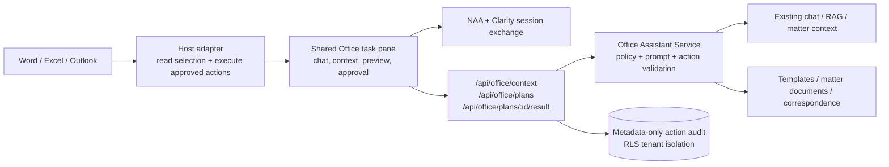

# Office Document Assistant Integration Plan

**Date:** 2026-07-25

**Status:** In progress — Slice 0 client and server foundations implemented

**Decision:** Build a cross-host Office.js add-in with one shared task-pane application and host-specific Word, Excel, and Outlook adapters. Keep document mutations local to the Office host and require a visible user approval before every write.

## Outcome

Clarity Legal should be able to understand the user's current Office context, propose a bounded change, preview the effect, and apply the approved change inside Word, Excel, or an Outlook item. The feature must reuse Clarity's tenant, matter, chat, template, research, and audit boundaries instead of creating a second assistant stack.

The first production path is Word because the repository already contains a Word prototype and legal drafting is the highest-value workflow. Outlook compose/read support follows, then Excel schedules and calculations. Outlook send interception is a later compliance feature, not part of the first release.

## Why Office.js

Use an Office web add-in rather than VSTO/COM, desktop UI automation, or Graph-only editing.

- Office.js runs in supported Word, Excel, and Outlook clients across Windows, web, and Mac, with host-specific availability checks.
- It can address the active selection and unsaved document state. Microsoft Graph cannot safely manipulate a user's current in-memory selection.
- It supports centralized Microsoft 365 deployment and a web security boundary.
- VSTO/COM would make the feature Windows/classic-Office specific and would not provide a sound path to new Outlook, Office on the web, or Mac.
- Server-side Open XML remains useful for template rendering and unattended DOCX/XLSX generation, but it is complementary to the add-in rather than a replacement for active-document interaction.

Microsoft's current guidance supports application-specific Word and Excel APIs, Outlook mailbox APIs, requirement-set checks, and Nested App Authentication (NAA). The unified Microsoft 365 manifest can target multiple hosts, but its Outlook client coverage still differs from the add-in-only manifest. For broad Outlook coverage, Clarity should ship two production manifests backed by one web application:

1. A task-pane add-in-only manifest for Word and Excel.
2. An Outlook add-in-only manifest for read and compose surfaces.

A unified JSON manifest can be evaluated for a single-install Microsoft 365 package after the feature passes the full client matrix; it should not be the only packaging path in the first release.

Official platform references:

- [Develop Office Add-ins](https://learn.microsoft.com/en-us/office/dev/add-ins/develop/develop-overview)
- [Nested app authentication for Office Add-ins](https://learn.microsoft.com/en-us/office/dev/add-ins/develop/enable-nested-app-authentication-in-your-add-in)
- [Nested app auth requirement sets](https://learn.microsoft.com/en-us/javascript/api/requirement-sets/common/nested-app-auth-requirement-sets)
- [Word JavaScript object model](https://learn.microsoft.com/en-us/office/dev/add-ins/word/word-add-ins-core-concepts)
- [Excel JavaScript object model](https://learn.microsoft.com/en-us/office/dev/add-ins/excel/excel-add-ins-core-concepts)
- [Outlook add-in APIs](https://learn.microsoft.com/en-us/office/dev/add-ins/outlook/apis)
- [Get or set an Outlook item body](https://learn.microsoft.com/en-us/office/dev/add-ins/outlook/insert-data-in-the-body)
- [Event-based activation and Smart Alerts](https://learn.microsoft.com/en-us/office/dev/add-ins/develop/event-based-activation)

## Current Repository Assessment

### Reusable product services

- `backend/app/routers/chat.py` already provides tenant-scoped conversations, matter context, RAG, source labels, streaming, usage accounting, and guardrails.
- `backend/app/routers/document_templates.py` already provides DOCX/PDF template intake, preview, smart fill, rendering, activation, and matter output.
- `backend/app/routers/matter_documents.py` and `backend/app/services/matter_file_store.py` already provide matter storage and cloud-backed file handling.
- Microsoft OAuth, encrypted provider tokens, OneDrive/SharePoint/Outlook sync, correspondence capture, and Teams gating already exist.
- The web application already uses short-lived HTTP-only access cookies with rotating Redis-backed refresh tokens.

### Prototype gaps that must be removed

The existing `word-addin/` is a useful interaction sketch, but it is not production-ready.

- It is a five-file vanilla JavaScript prototype with no automated tests or build-time type checking.
- The manifest and API URL are localhost-only.
- It stores a Clarity bearer token in `localStorage`.
- Its popup code waits for `?token=...`, while the current backend redirects with a one-time `?code=...` and expects `/api/auth/oauth/exchange` to establish HTTP-only cookies.
- It uses the common text-coercion API only, so formatting, stable anchors, comments, content controls, tables, formulas, and tracked-edit behavior are absent.
- It sends selected text by concatenating it into a chat prompt and inserts the entire assistant answer as plain text.
- It has no stale-document check, action preview, write approval, execution audit, capability gate, or tenant-configurable data-minimization policy.
- Some UI strings are already mojibake, showing that the prototype lacks a controlled UTF-8 build pipeline.

The existing prototype should remain available during the first implementation slice, then be replaced after Word parity is proven.

## Target Architecture



The backend proposes commands; it never reaches into a desktop application. The add-in reads only the context authorized by the user, validates the returned plan against its local capability registry, displays a preview, and executes the approved commands through Office.js.

## Shared Client Design

Create `office-addin/` as an independent TypeScript/Vite application. It can share design tokens and API contracts with `frontend/`, but it should have its own build, tests, manifests, and release artifact so an add-in release cannot accidentally change the main SPA.

Suggested structure:

```text
office-addin/
  manifests/
    word-excel.xml
    outlook.xml
    manifest.unified.json       # optional evaluation artifact
  src/
    app/
    auth/
    api/
    contracts/
    hosts/
      hostAdapter.ts
      wordAdapter.ts
      excelAdapter.ts
      outlookAdapter.ts
    preview/
    telemetry/
  tests/
  package.json
  vite.config.ts
```

`HostAdapter` exposes a deliberately small interface:

```ts
type HostAdapter = {
  capabilities(): Promise<HostCapabilities>;
  captureContext(request: ContextRequest): Promise<OfficeContextEnvelope>;
  preview(plan: OfficeActionPlan): Promise<ActionPreview>;
  execute(plan: OfficeActionPlan): Promise<ActionExecutionResult>;
};
```

No model output may call Office.js directly. Every write must match a registered action type with a strict JSON schema and host capability check.

## Authentication and Authorization

### Authentication flow

1. Serve the production task pane and `/api` from the same HTTPS origin, for example `https://app.claritylegal.example/office/` and `https://app.claritylegal.example/api/`.
2. Configure an Entra SPA redirect for NAA using `brk-multihub://<production-origin>` plus the required web fallback redirect.
3. Request only the Clarity API delegated scope needed to establish a Clarity session. Do not request broad Graph scopes merely to edit the active Office item; Office.js supplies that access.
4. Add `POST /api/auth/office/exchange`. It validates the Entra access token's signature, issuer, audience, tenant, authorized party, expiry, and delegated scope.
5. Map the verified Entra `tid`/`oid` to an existing active Clarity user. The add-in must not silently create a new firm or tenant. A verified-email fallback may link an already-provisioned user once, then persist the immutable Entra identifiers.
6. Issue the existing short-lived HTTP-only Clarity cookies and rotating refresh family. Never expose a Clarity access or refresh token to JavaScript or `localStorage`.
7. Use the Office Dialog API/MSAL fallback only when NAA is unavailable. Keep Google/password login as an explicit fallback only if product requirements demand it.

### Authorization checks

- Enforce existing tenant and module middleware on every Office endpoint.
- Add an `office_assistant` capability and finer write capabilities only if current role capabilities are too coarse: `office_read_context`, `office_apply_changes`, and `office_capture_to_matter`.
- Re-check user, tenant, matter access, module entitlement, and action policy when creating a plan and again when accepting its result.
- Never treat the Microsoft tenant administrator or mailbox owner as a Clarity tenant administrator automatically.

## Context Contract and Data Minimization

The add-in sends an explicit `OfficeContextEnvelope`, not an automatic full-document dump.

Common fields:

- `surface`: `word`, `excel`, or `outlook`.
- `mode`: `read`, `compose`, or `edit` as appropriate.
- `document_fingerprint`: a local hash of the relevant base content and anchor metadata.
- `selection`: selected text/cells/body fragment plus length and format metadata.
- `surrounding_context`: optional and bounded; off by default unless the user chooses it or a tenant policy allows it.
- `host_capabilities`: runtime requirement sets and supported action names.
- `matter_id` and `conversation_id`: optional explicit Clarity links.
- `classification`: sensitivity/IRM availability flags where the host exposes them.

Default limits:

- Word: selection only, with an optional bounded paragraph window. Whole-document analysis requires an explicit user action and size confirmation.
- Excel: selected range or selected table only, with dimensions and formulas clearly distinguished from displayed values. Reject oversized or discontiguous selections until a dedicated chunking flow exists.
- Outlook: current item only. In read mode, capture subject, sender, recipients, and the explicitly requested body mode. In compose mode, capture the current draft and selected body content. Warn that some clients return the full conversation thread when reading a reply body.
- Never collect hidden sheets, comments, tracked revisions, attachments, BCC, or prior thread content unless the user selects the corresponding operation and the host supports a reliable boundary.
- Raw Office content follows the existing model-provider policy. Action audit rows store metadata and hashes by default, not duplicate document bodies.

## Structured Action Protocol

The assistant response for an in-document operation is an `OfficeActionPlan`, separate from conversational text.

```json
{
  "plan_id": "uuid",
  "surface": "word",
  "expires_at": "2026-07-25T20:00:00Z",
  "base_fingerprint": "sha256:...",
  "summary": "Tighten the selected indemnity clause",
  "warnings": ["Attorney review required"],
  "actions": [
    {
      "type": "replace_selection",
      "anchor": {"selection_hash": "sha256:..."},
      "content": {"text": "...", "format": "text"}
    }
  ]
}
```

Rules:

- Plans expire quickly and are bound to the surface, user, tenant, base fingerprint, and selection/range anchor.
- The client rejects unknown action types, excessive payloads, changed anchors, unsupported requirement sets, and plans for a different host.
- The preview shows a text diff for Word/Outlook and a cell/formula diff for Excel.
- Apply is a separate user gesture. Chat submission is not approval to mutate the host document.
- The client reports `applied`, `rejected`, `stale`, or `failed`, including action counts and sanitized error codes.
- Retry requires a fresh anchor check. A stale plan is never force-applied.

Initial action allowlist:

The checked-in Slice 0 client currently enables only deterministic anchors:
Word selection replacement, Excel selected-range values/formulas, and Outlook
subject changes. Cursor-dependent Word insertion and Outlook body changes stay
disabled until content-control or equivalent stable anchors are implemented and
tested. The table below is the broader target for the first production release.

| Host | First release | Later, runtime-gated |
|---|---|---|
| Word | insert at cursor, replace selection, wrap/locate a Clarity content control, apply paragraph/style metadata | OOXML rich insertion, comments, tracked-revision workflows, multi-section operations |
| Excel | set selected values, set explicitly previewed formulas, add rows to a selected table, apply bounded formatting | create tables/charts, multi-sheet plans, reconciliation helpers |
| Outlook | insert/replace selected compose-body content, prepend a draft, set subject with confirmation, create a reply draft | recipient changes, attachment workflows, event-based checks, Smart Alerts |

No release may include a generic `execute_script`, macro, arbitrary Office.js expression, or unrestricted OOXML command.

## Backend Components

### Router

Add `backend/app/routers/office_assistant.py`:

- `POST /api/office/context` — validate and normalize the host context; return a redaction/size summary before model use when required.
- `POST /api/office/plans` — produce a schema-valid action plan using the existing conversation, RAG, matter context, and drafting guardrails.
- `POST /api/office/plans/{plan_id}/result` — record user decision and client execution outcome.
- `POST /api/office/capture` — explicitly save an Outlook item, Word output, or Excel artifact to a matter using existing storage/correspondence services.
- `GET /api/office/policy` — return tenant limits, enabled surfaces/actions, retention mode, and requirement-set floors.

Streaming can be used for conversational text, but the actionable plan must be validated as a complete object before the Apply control becomes enabled.

### Services and schemas

- `backend/app/services/office_assistant.py` — orchestration, policy enforcement, prompt construction, action validation, and reuse of chat/RAG/matter context.
- `backend/app/services/office_action_policy.py` — host/action registry, payload limits, capability and role checks.
- `backend/app/schemas/office_assistant.py` — discriminated Pydantic models for every context and action type; reject unknown fields.
- Reuse or extract a shared drafting service from existing chat/template code rather than copying prompt logic into the router.

### Audit model

Add an RLS-protected `office_action_runs` table:

- Tenant/user/matter/conversation IDs.
- Surface, operation name, plan ID, capability set, and client version.
- Base/result hashes, counts, decision, timestamps, latency, and sanitized failure code.
- No raw selected text, email body, replacement content, cell values, or formulas by default.
- Optional exact before/after snapshots only through an explicit tenant retention policy that stores them as encrypted matter work product, not as generic telemetry.

## Host Delivery Slices

### Slice 0 — Foundation and threat-model spike

- Create the TypeScript/Vite add-in package and shared contracts.
- Add production/dev URL injection; remove hard-coded localhost endpoints.
- Implement NAA plus the Clarity session exchange and dialog fallback.
- Implement capability detection, CSP, error boundary, telemetry redaction, and manifest validation.
- Add the action schema, local validator, stale-anchor check, preview shell, and metadata-only audit model.
- Prove Word/Excel task-pane and Outlook read/compose activation in the supported test tenants before feature work.

**Exit gate:** a provisioned Clarity user can sign in without any JavaScript-readable Clarity token, unsupported hosts fail clearly, and a fake/expired/cross-tenant plan cannot be applied.

### Slice 1 — Word production MVP

- Read the current selection and an explicitly requested paragraph window.
- Offer actions such as Explain, Summarize, Rewrite, Redline selection, Insert clause, and Review against matter/template sources.
- Preview before/after text and warnings.
- Apply insert/replace through `Word.run`; preserve paragraphs and supported formatting rather than common-API plain-text insertion.
- Add Clarity content-control tags for generated regions so later edits can re-anchor safely.
- Runtime-gate tracked changes and comments. Never silently change the user's global track-changes preference; restore it if an approved operation temporarily changes it.
- Allow explicit save/capture to an accessible matter through existing matter-document services.

**Exit gate:** selection-scoped review and replacement work in current Word on Windows, web, and Mac; stale selection prevents apply; undo works; applied actions are audited without body content.

### Slice 2 — Outlook read and compose

- Read mode: summarize the current message, extract tasks/deadlines, suggest a matter/contact, and explicitly capture correspondence.
- Compose mode: draft or revise the selected/current body, insert the approved response, and optionally set a confirmed subject.
- Show exactly which body/thread scope will be sent to Clarity.
- Do not send mail, add recipients, or upload attachments in the MVP.
- Handle new Outlook, classic Outlook, Outlook on the web, and Mac through the Outlook add-in-only manifest and requirement-set fallbacks.

**Exit gate:** a user can review one message, create a reply draft, insert it after preview, and capture the correspondence to the correct matter without granting `ReadWriteMailbox` or broad Graph mail permission.

### Slice 3 — Excel schedules and calculations

- Capture the selected range/table with addresses, displayed values, formulas, types, and number formats.
- Offer Explain formula, Normalize table, Categorize rows, Build damages/asset schedule, Reconcile totals, and Populate selected cells.
- Preview every changed cell and distinguish values from formulas visually.
- Restrict writes to the approved selection/table and enforce cell-count/formula limits.
- Reject external links, macros, volatile formulas, hidden-sheet writes, and multi-sheet operations in the MVP.

**Exit gate:** selected-range analysis and bounded value/formula updates work in Excel on Windows, web, and Mac, with deterministic stale-range rejection and formula-specific tests.

### Slice 4 — Governed automation

- Add Word document-open helpers only after event-based activation support and client limitations are accepted.
- Add Outlook recipient/attachment checks and Smart Alerts in prompt-user or soft-block mode first.
- Keep hard-block send policies admin-deployed and opt-in; they must have fail-open/fail-closed behavior explicitly chosen by the tenant and exercised during backend/Exchange outages.
- Add template-to-document content-control binding and repeated deterministic smart-fill.
- Evaluate the unified Microsoft 365 manifest and integration with the existing Teams package.

**Exit gate:** background/event handlers meet Microsoft's runtime constraints, complete reliably offline/degraded where supported, and cannot strand users in a send-blocked state without an approved tenant policy.

### Slice 5 — Distribution and marketplace readiness

- Centralized deployment runbook for pilot tenants.
- Microsoft Marketplace privacy, support, data-retention, scope-justification, and validation artifacts.
- Versioned manifest/package release, rollback, and tenant-ring controls.
- Support matrix and in-product unsupported-client messaging.

## Testing Strategy

### Unit and contract tests

- Host adapter tests with mocked Office.js contexts.
- Exhaustive discriminated-union tests for every context and action schema.
- Unknown action, oversized selection, out-of-range write, stale anchor, expired plan, surface mismatch, and cross-tenant rejection.
- Text diff and Excel cell/formula diff correctness.
- Auth token issuer/audience/scope/tenant/expiry/authorized-party failures.
- Audit redaction tests asserting that selected/replacement content never enters default logs or audit rows.

### Backend integration tests

- RLS isolation for policies, plans, results, matter capture, and audit rows.
- Module/capability enforcement for read, apply, and capture.
- Existing chat/RAG source behavior remains unchanged outside `office` mode.
- Model returns malformed or disallowed actions: fail closed and preserve conversational response only.
- Idempotent result reporting and duplicate apply-result handling.

### Office client matrix

At minimum:

| Surface | Windows | Web | Mac | Mobile |
|---|---:|---:|---:|---:|
| Word | required | required | required | evaluate/read-only |
| Excel | required | required | required | evaluate/read-only |
| Outlook read/compose | new + classic | required | required | later |

Each supported cell includes sign-in, selection/context capture, preview, apply, stale rejection, logout/refresh, offline/degraded behavior, and centralized deployment.

### Security tests

- Malicious prompt content attempting to emit unknown actions or change anchors.
- HTML/OOXML injection and unsafe URL sanitization.
- IRM/sensitivity-protected content behavior.
- Cross-origin framing, CSP, CORS, clickjacking, and dialog-origin validation.
- No secret/token in local storage, query strings, logs, crash reports, or Office document properties.
- Large-document/range denial-of-service limits and model cost ceilings.

## Operations and Rollout

- Feature flags per tenant and per host: `OFFICE_ASSISTANT_ENABLED`, `OFFICE_WORD_ENABLED`, `OFFICE_OUTLOOK_ENABLED`, `OFFICE_EXCEL_ENABLED`, and `OFFICE_EVENT_ACTIONS_ENABLED`.
- Pilot with internal/test tenants, then one design-partner firm, then ring deployment.
- Record action success/stale/reject/failure rates, but never raw document content.
- Provide a kill switch that disables plan creation and writes while leaving the main web application unaffected.
- Manifest changes require admin deployment/consent planning; task-pane web code can roll forward independently only when contracts remain backward compatible.
- Preserve the legacy `word-addin/` until Word MVP parity; then remove it and update SBOM inventory in the same change.

## Recommended Sequencing and Size

| Slice | Size | Depends on |
|---|---|---|
| 0. Foundation/auth/action protocol | Large | Entra app registration, production add-in origin, test tenant |
| 1. Word MVP | Large | Slice 0 |
| 2. Outlook read/compose | Large | Slice 0; can start after shared contracts stabilize |
| 3. Excel MVP | Large | Slice 0; can start after shared contracts stabilize |
| 4. Governed automation | Large | Host MVP telemetry and policy decisions |
| 5. Distribution/marketplace | Medium | Stable manifests, support matrix, privacy review |

Do not parallelize host implementations before Slice 0 locks authentication, context, action, audit, and compatibility contracts. After that gate, Outlook and Excel adapters can proceed independently.

## Product Decisions Still Needed

These do not block Slice 0 technical work but must be resolved before a customer pilot:

1. Whether whole-document analysis is permitted at all, or only selection/section analysis.
2. Whether exact before/after snapshots are retained as matter work product or never retained.
3. Minimum supported Office channels/builds and whether mobile is explicitly unsupported in v1.
4. Whether non-Microsoft Clarity accounts may use the Office add-in through dialog login.
5. Whether Outlook correspondence capture creates a draft matter link automatically or always requires confirmation.
6. Whether tracked changes are mandatory for every Word replacement or a user-selectable mode.
7. Whether Excel formulas are enabled in the first customer ring or values-only until formula review is accepted.

## Definition of Done for the First Customer Release

- Word selection analysis, preview, approved replace/insert, matter capture, and source-aware chat pass the Windows/web/Mac matrix.
- NAA/session exchange is production-configured; no Clarity token is JavaScript-readable or placed in a URL.
- Every write is schema-validated, capability-gated, fingerprint-bound, previewed, approved, and result-audited.
- Tenant isolation and metadata-only retention tests pass.
- Unsupported clients and protected-content cases fail clearly without modifying the document.
- Centralized deployment, rollback, kill-switch, privacy, support, and incident procedures are documented and rehearsed.
- Outlook and Excel remain disabled until their own host exit gates pass; their unfinished presence must not broaden permissions or marketplace claims.
