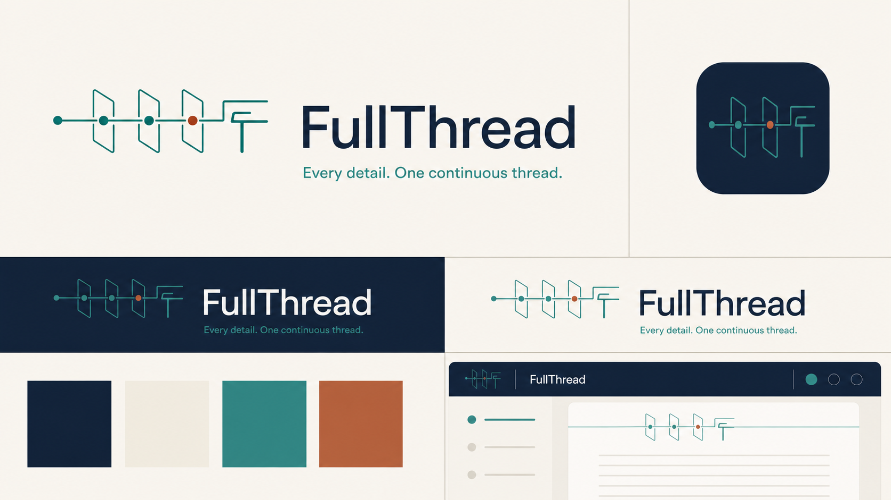
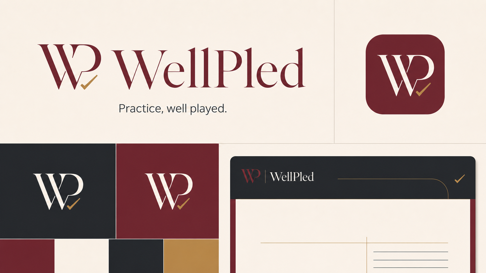
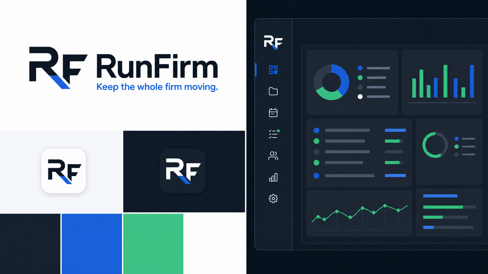

# Brand directions: FullThread, WellPled, and RunFirm

Date: July 31, 2026

These are strategic identity directions, not trademark-clearance opinions or production vector artwork. The visual boards establish the territory to refine after a name is selected.

## Executive recommendation

1. **FullThread — strongest master brand.** It says what the product uniquely does without describing a generic legal-software category. It supports a durable story about complete context, provenance, continuity, and forward motion.
2. **WellPled — strongest emotional brand.** It is the most attorney-native, memorable, and characterful. It creates affinity quickly, though the name communicates quality of legal work more readily than firm-wide operations.
3. **RunFirm — strongest direct-response name.** It is immediately understood and lends itself to forceful marketing. Its weakness is strategic distinctiveness: the words are functional and the brand territory is easier for competitors to imitate.

If selecting one company and product name today, choose **FullThread**. If building a brand that wins through lawyer wit and personality, choose **WellPled**. Treat **RunFirm** as the conversion benchmark and possible campaign language even if it is not the master brand.

---

## 1. FullThread

### Brand platform

- **Position:** The complete operational context for every matter and every next action.
- **Core promise:** Nothing important falls out of context.
- **Tagline:** Every detail. One continuous thread.
- **Internal brand idea:** One source. Every thread. Always moving.
- **Personality:** Intelligent, composed, connective, exact, quietly modern.

### Messaging

- **Hero:** The full context. The next action.
- **Support:** FullThread brings documents, conversations, deadlines, decisions, and responsibilities into one living record—so the firm can act without reconstructing what happened.
- **Primary CTA:** See the full thread
- **Secondary CTA:** Bring your work together
- **Proof language:** Complete context. Clear ownership. Continuous momentum.

### Visual system

- **Symbol:** One continuous line moving through records or decision planes, ending in an ownable FT construction. It represents provenance and continuity—not thread as fabric.
- **Wordmark:** Calm humanist grotesk with generous spacing and a deliberately plainspoken silhouette.
- **Ink Navy — `#142238`:** Authority, navigation, long-form text.
- **Warm Parchment — `#F6F3EC`:** Primary canvas; humanizes the software.
- **Signal Teal — `#2D8C82`:** Connected and active states.
- **Restrained Copper — `#B56F4A`:** High-value facts, changes, and human attention.
- **Motion:** A line can travel through evidence, people, and events to reveal their relationship. Motion should be slow and precise, never decorative.

### Voice

Use complete, direct sentences. Explain what is connected and what happens next. Avoid futuristic AI language and vague promises about transformation.

Examples:

- Every decision keeps its history.
- Start with the whole story.
- Know what changed—and what it changes.

### Refinement note

The visual idea is strategically right, but the symbol should be simplified before production so it remains legible at 16–24 pixels. Preserve the continuous line and one copper point; reduce the number of planes.

---

## 2. WellPled

### Brand platform

- **Position:** Practice software for work that is prepared, precise, and well played.
- **Core promise:** Your firm is ready before the moment matters.
- **Tagline:** Practice, well played.
- **Personality:** Articulate, assured, discerning, warm, quietly witty.

### Messaging

- **Hero:** Your best work, already in context.
- **Support:** WellPled keeps the facts, work, deadlines, and decisions organized around the way excellent attorneys actually practice.
- **Primary CTA:** See it in practice
- **Secondary CTA:** Work the matter
- **Proof language:** Better prepared. Better coordinated. Better played.

### Visual system

- **Symbol:** A custom WP ligature completed by a restrained decision mark. The interaction should feel typographic and intentional, not like a generic task-management check.
- **Wordmark:** High-contrast contemporary serif, supported by a neutral sans serif throughout the product.
- **Deep Oxblood — `#6E2432`:** Primary brand field; serious without defaulting to navy.
- **Warm Ivory — `#F7F0E6`:** Editorial canvas and document background.
- **Charcoal — `#25272B`:** Product UI, text, and dark applications.
- **Muted Brass — `#B58A4B`:** Selective emphasis and completed decisions.
- **Texture:** Crisp rules, marginal annotations, and generous editorial whitespace. Never imitate old parchment or law-office decor.

### Voice

Write with lawyer-level precision and a restrained wink. Wordplay should reward attention rather than become the entire message.

Examples:

- Be ready before it is urgent.
- Every detail, well placed.
- Good work holds up.

### Refinement note

This is the most immediately ownable visual world. Refine the monogram so the check is integrated into the letter construction rather than appended beneath it. That will make the mark feel bespoke instead of productivity-adjacent.

---

## 3. RunFirm

### Brand platform

- **Position:** The operating system that keeps the entire firm moving.
- **Core promise:** The work moves, and everyone knows where it stands.
- **Tagline:** Keep the whole firm moving.
- **Personality:** Decisive, energetic, capable, transparent, pragmatic.

### Messaging

- **Hero:** Run the work. Run the firm.
- **Support:** RunFirm coordinates matters, people, deadlines, clients, and knowledge in one operating view—so progress does not depend on chasing updates.
- **Primary CTA:** See your firm in motion
- **Secondary CTA:** Take the tour
- **Proof language:** Clear work. Clear owners. Forward motion.

### Visual system

- **Symbol:** A highly legible RF monogram with one controlled forward cut. The letters must remain unmistakable at favicon size.
- **Wordmark:** Bold geometric sans serif with a sober, operational cadence.
- **Deep Graphite — `#17202A`:** Command-center foundation.
- **Electric Cobalt — `#2364D2`:** Primary action and live work.
- **Fresh Mint — `#47C58A`:** Movement, completion, and healthy status.
- **Crisp White — `#FFFFFF`:** Clarity and working space.
- **Motion:** Items progress across a stable system; avoid speed lines, sports motifs, and constant animation.

### Voice

Prefer verbs, outcomes, and visible operational truth. Keep sentences short. Do not overuse “run” in every line.

Examples:

- Know what is moving.
- Make the next owner obvious.
- Progress without the status meeting.

### Refinement note

The corrected RF icon is readable, but this territory can drift toward fintech or analytics software. A production refinement should introduce one uniquely legal-work behavior in the motion system—such as a fact becoming an assigned action—without adding legal clichés to the logo.

---

## Side-by-side decision test

| Criterion | FullThread | WellPled | RunFirm |
|---|---:|---:|---:|
| Expresses the product's source-of-truth advantage | 5/5 | 3/5 | 4/5 |
| Attorney affinity and memorability | 4/5 | 5/5 | 3/5 |
| Immediate comprehension | 4/5 | 3/5 | 5/5 |
| Distinctive brand territory | 5/5 | 5/5 | 2/5 |
| Supports expansion beyond one workflow | 5/5 | 4/5 | 4/5 |
| Premium visual potential | 5/5 | 5/5 | 3/5 |
| **Strategic total** | **28/30** | **25/30** | **21/30** |

## Recommended next design round

Take **FullThread** and **WellPled** into production-style finalists:

1. Simplify each symbol into one-color vector geometry.
2. Test at favicon, browser-header, sidebar, document export, and conference-booth sizes.
3. Build one landing-page hero and one real product screen per name using identical product content.
4. Test unprompted recall, pronunciation, perceived function, and trust with 8–12 attorneys or legal operations buyers.
5. Perform formal trademark and domain counsel review before adopting either identity.

RunFirm should remain in the test as the comprehension control: if FullThread or WellPled cannot beat it after a five-second product explanation, the messaging needs work.
